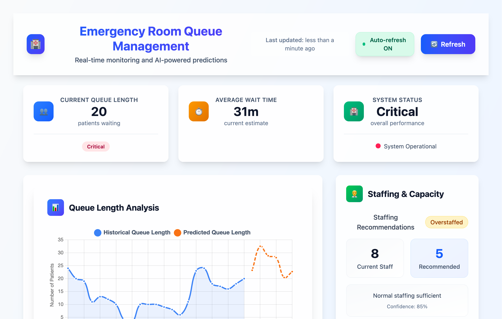

# Emergency Room Queue Management System - Complete Project Plan

## How to run it

```
# install bun (https://bun.sh) and then
$ bun run install
$ bun run dev
```



## Project Overview

An IoT-based emergency room queue management system that collects real-time data from simulated sensors, processes it through a Fastify API server, and provides real-time queue monitoring and data visualization. Since this is an MVP, an actual AI model is not used for predicting the queue but that would be the logical next step.

## Technology Stack

- **Runtime**: Bun (JavaScript/TypeScript runtime)
- **Backend**: Node.js with Fastify
- **Language**: TypeScript
- **Database**: In-memory storage (with interfaces for future SQL migration)
- **Frontend**: React + Vite + TailwindCSS dashboard
- **IoT Simulation**: TypeScript scripts generating realistic sensor data

## Project Structure

```
emergency-room-queue-system/
├── apps/
│   ├── queue-management-api/       # Main emergency room queue API
│   │   ├── package.json
│   │   ├── tsconfig.json
│   │   ├── bun.lockb
│   │   ├── src/
│   │   │   ├── app.ts              # Main Fastify application
│   │   │   ├── features/
│   │   │   │   ├── queue-status/
│   │   │   │   │   ├── queue-status.controller.ts
│   │   │   │   │   ├── queue-status.service.ts
│   │   │   │   │   ├── queue-status.repository.ts
│   │   │   │   │   ├── queue-status.types.ts
│   │   │   │   │   └── index.ts
│   │   │   │   ├── predictions/
│   │   │   │   │   ├── predictions.controller.ts
│   │   │   │   │   ├── predictions.service.ts
│   │   │   │   │   ├── chronos-prediction.service.ts
│   │   │   │   │   ├── predictions.types.ts
│   │   │   │   │   └── index.ts
│   │   │   │   ├── iot-data/
│   │   │   │   │   ├── iot-data.controller.ts
│   │   │   │   │   ├── iot-data.service.ts
│   │   │   │   │   ├── iot-data.repository.ts
│   │   │   │   │   ├── iot-data.types.ts
│   │   │   │   │   └── index.ts
│   │   │   │   └── dashboard-api/
│   │   │   │       ├── dashboard.controller.ts
│   │   │   │       ├── dashboard.service.ts
│   │   │   │       ├── dashboard.types.ts
│   │   │   │       └── index.ts
│   │   │   ├── shared/
│   │   │   │   ├── types/
│   │   │   │   │   ├── common.ts
│   │   │   │   │   ├── queue.ts
│   │   │   │   │   ├── sensor.ts
│   │   │   │   │   └── prediction.ts
│   │   │   │   ├── repositories/
│   │   │   │   │   ├── in-memory-data.repository.ts
│   │   │   │   │   └── repository.interface.ts
│   │   │   │   ├── plugins/
│   │   │   │   │   ├── cors.ts
│   │   │   │   │   └── static.ts
│   │   │   │   ├── utils/
│   │   │   │   │   ├── service-container.ts
│   │   │   │   │   └── date-helpers.ts
│   │   │   │   └── clients/
│   │   │   │       └── mock-iot-client.ts
│   │   │   └── config/
│   │   │       ├── server.ts
│   │   │       └── ml-model.ts
│   │   └── scripts/
│   │       ├── start-server.ts
│   │       └── run-predictions.ts
│   ├── mock-iot-api/               # Disposable IoT mock - returns hardcoded data
│   │   ├── package.json
│   │   ├── tsconfig.json
│   │   ├── bun.lockb
│   │   ├── src/
│   │   │   ├── app.ts              # Simple Fastify server
│   │   │   ├── data/
│   │   │   │   ├── current-hour-readings.ts   # Hardcoded readings for current hour
│   │   │   │   └── reading-generator.ts       # Generates next reading in sequence
│   │   │   └── routes/
│   │   │       ├── sensor-readings.ts         # GET endpoints for sensor data
│   │   │       └── health.ts                  # Health check endpoint
│   │   └── scripts/
│   │       └── start-mock.ts
│   └── dashboard-ui/               # React + Vite + Tailwind dashboard
│       ├── package.json
│       ├── vite.config.ts
│       ├── tailwind.config.js
│       ├── postcss.config.js
│       ├── index.html
│       ├── src/
│       │   ├── main.tsx            # React entry point
│       │   ├── App.tsx             # Main App component
│       │   ├── components/
│       │   │   ├── QueueStatus.tsx
│       │   │   ├── SensorReadings.tsx
│       │   │   ├── PredictionCharts.tsx
│       │   │   └── AlertsPanel.tsx
│       │   ├── services/
│       │   │   └── api-client.ts   # API communication
│       │   ├── types/
│       │   │   └── api-types.ts    # Type definitions
│       │   └── index.css           # Tailwind imports
│       └── public/
│           └── vite.svg
└── README.md
```

## Core Components & Implementation Details

### 1. Main Queue Management API (`apps/queue-management-api/`)

#### Feature-based Structure:

Each feature contains its own controller, service, repository, and types, following the package-by-feature principle.

#### Queue Status Feature (`src/features/queue-status/`)

```typescript
// queue-status.types.ts
export interface QueueData {
  timestamp: Date;
  totalPatients: number;
  waitingPatients: number;
  averageWaitTime: number;
  triage: {
    critical: number;
    urgent: number;
    standard: number;
  };
  roomOccupancy: {
    total: number;
    occupied: number;
    available: number;
  };
}

// queue-status.service.ts
export class QueueStatusService {
  async getCurrentStatus(): Promise<QueueData>;
  async getHistoricalData(hours: number): Promise<QueueData[]>;
  async getAnalytics(): Promise<QueueAnalytics>;
}

// queue-status.controller.ts
export class QueueStatusController {
  // GET /api/queue/current
  // GET /api/queue/history/:hours
  // GET /api/queue/analytics
}
```

#### Predictions Feature (`src/features/predictions/`)

```typescript
// predictions.types.ts
export interface Prediction {
  timestamp: Date;
  forecastedValue: number;
  confidenceInterval: {
    lower: number;
    upper: number;
  };
  type: "queue-length" | "wait-time";
}

// chronos-prediction.service.ts
export class ChronosPredictionService {
  async predictQueueLength(
    historicalData: QueueData[],
    forecastHours: number
  ): Promise<Prediction[]>;
  async predictWaitTimes(
    currentState: QueueData,
    historicalData: QueueData[]
  ): Promise<Prediction[]>;
}

// predictions.controller.ts
export class PredictionsController {
  // GET /api/predictions/queue-forecast/:hours
  // GET /api/predictions/wait-time-forecast
  // POST /api/predictions/generate-insights
}
```

#### IoT Data Feature (`src/features/iot-data/`)

```typescript
// iot-data.types.ts
export interface SensorReading {
  sensorId: string;
  sensorType: "arrival" | "wait-time" | "occupancy" | "staff";
  timestamp: Date;
  value: number;
  metadata: Record<string, any>;
}

// iot-data.service.ts
export class IoTDataService {
  async processSensorReading(reading: SensorReading): Promise<void>;
  async getSensorHealth(): Promise<SensorHealth[]>;
}

// iot-data.controller.ts
export class IoTDataController {
  // POST /api/iot/sensor-data
  // GET /api/iot/sensors
  // GET /api/iot/sensor-status
}
```

#### Dashboard API Feature (`src/features/dashboard-api/`)

```typescript
// dashboard.service.ts
export class DashboardService {
  async getOverviewData(): Promise<DashboardOverview>;
  async getRealTimeUpdates(): Promise<RealTimeData>;
}

// dashboard.controller.ts
export class DashboardController {
  // GET /api/dashboard/overview
  // GET /api/dashboard/real-time
  // Provides data for React dashboard
}
```

### 4. React Dashboard (`apps/dashboard-ui/`)

Simple, barebones React application built with Vite and Tailwind CSS.

#### Main Components (`src/components/`)

```typescript
// QueueStatus.tsx
export const QueueStatus: React.FC = () => {
  // Displays current queue metrics
  // - Total patients
  // - Average wait time
  // - Room occupancy
};

// SensorReadings.tsx
export const SensorReadings: React.FC = () => {
  // Shows latest sensor data
  // - Patient arrivals
  // - Wait times
  // - Staff availability
};

// AnalyticsCharts.tsx
export const AnalyticsCharts: React.FC = () => {
  // Simple charts for analytics
  // - Queue length trends
  // - Wait time statistics
};

// AlertsPanel.tsx
export const AlertsPanel: React.FC = () => {
  // Basic alerts for critical conditions
  // - High queue alerts
  // - Long wait time warnings
};
```

#### API Client (`src/services/`)

```typescript
// api-client.ts
export class ApiClient {
  private baseUrl: string = "http://localhost:3000";

  async getQueueStatus(): Promise<QueueData>;
  async getAnalytics(): Promise<AnalyticsData[]>;
  async getDashboardOverview(): Promise<DashboardOverview>;
}
```

### 2. Shared Components (`src/shared/`)

#### Repository Interface (`src/shared/repositories/`)

```typescript
// repository.interface.ts
export interface IDataRepository {
  saveQueueData(queueData: QueueData): Promise<void>;
  getQueueDataByTimeRange(startTime: Date, endTime: Date): Promise<QueueData[]>;
  getLatestQueueData(): Promise<QueueData | null>;
  saveSensorReading(sensorReading: SensorReading): Promise<void>;
  getSensorReadings(
    sensorType: string,
    timeRange: { start: Date; end: Date }
  ): Promise<SensorReading[]>;
  getHistoricalData(hours: number): Promise<QueueData[]>;
}

// in-memory-data.repository.ts
export class InMemoryDataRepository implements IDataRepository {
  // Implementation for development/testing
}
```

### 3. Mock IoT API (`apps/mock-iot-api/`)

This is a **disposable** mock service that provides hardcoded sensor readings for the current hour only. Each API call returns the next reading in sequence.

#### Current Hour Readings (`src/data/`)

```typescript
// current-hour-readings.ts
export const CURRENT_HOUR_READINGS = {
  patientArrivals: [
    { timestamp: "2025-05-29T14:00:00Z", value: 2 },
    { timestamp: "2025-05-29T14:05:00Z", value: 1 },
    { timestamp: "2025-05-29T14:10:00Z", value: 3 },
    { timestamp: "2025-05-29T14:15:00Z", value: 0 },
    { timestamp: "2025-05-29T14:20:00Z", value: 2 },
    // ... up to current hour only
  ],
  waitTimes: [
    { timestamp: "2025-05-29T14:00:00Z", value: 45 },
    { timestamp: "2025-05-29T14:05:00Z", value: 48 },
    { timestamp: "2025-05-29T14:10:00Z", value: 52 },
    // ... up to current hour only
  ],
  roomOccupancy: [
    { timestamp: "2025-05-29T14:00:00Z", value: 12 },
    { timestamp: "2025-05-29T14:05:00Z", value: 15 },
    { timestamp: "2025-05-29T14:10:00Z", value: 14 },
    // ... up to current hour only
  ],
  staffAvailability: [
    { timestamp: "2025-05-29T14:00:00Z", value: 8 },
    { timestamp: "2025-05-29T14:05:00Z", value: 7 },
    { timestamp: "2025-05-29T14:10:00Z", value: 8 },
    // ... up to current hour only
  ],
};

// reading-generator.ts
export class ReadingGenerator {
  private currentIndex: number = 0;

  getNextReading(sensorType: string): SensorReading | null {
    const readings = CURRENT_HOUR_READINGS[sensorType];
    if (!readings || this.currentIndex >= readings.length) {
      return null; // No more readings for current hour
    }

    const reading = readings[this.currentIndex];
    this.currentIndex++;
    return {
      sensorId: `${sensorType}-001`,
      sensorType,
      ...reading,
    };
  }

  reset(): void {
    this.currentIndex = 0;
  }
}
```

#### Simple Mock Endpoints (`src/routes/`)

```typescript
// sensor-readings.ts
export const sensorRoutes = async (fastify: FastifyInstance) => {
  const generator = new ReadingGenerator();

  // GET /api/sensors/patient-arrivals/next
  fastify.get("/api/sensors/patient-arrivals/next", async (request, reply) => {
    const reading = generator.getNextReading("patientArrivals");
    if (!reading) {
      return reply.code(204).send(); // No more data for current hour
    }
    return reading;
  });

  // GET /api/sensors/wait-times/next
  fastify.get("/api/sensors/wait-times/next", async (request, reply) => {
    const reading = generator.getNextReading("waitTimes");
    if (!reading) {
      return reply.code(204).send();
    }
    return reading;
  });

  // GET /api/sensors/room-occupancy/next
  fastify.get("/api/sensors/room-occupancy/next", async (request, reply) => {
    const reading = generator.getNextReading("roomOccupancy");
    if (!reading) {
      return reply.code(204).send();
    }
    return reading;
  });

  // GET /api/sensors/staff-availability/next
  fastify.get(
    "/api/sensors/staff-availability/next",
    async (request, reply) => {
      const reading = generator.getNextReading("staffAvailability");
      if (!reading) {
        return reply.code(204).send();
      }
      return reading;
    }
  );

  // POST /api/sensors/reset (for testing)
  fastify.post("/api/sensors/reset", async (request, reply) => {
    generator.reset();
    return { message: "Readings reset to beginning of current hour" };
  });
};

// health.ts
export const healthRoutes = async (fastify: FastifyInstance) => {
  // GET /api/health
  fastify.get("/api/health", async (request, reply) => {
    return {
      status: "ok",
      timestamp: new Date().toISOString(),
      message: "Mock IoT API is running",
    };
  });
};
```

#### Main API Integration (`src/shared/clients/`)

```typescript
// mock-iot-client.ts
export class MockIoTClient {
  private baseUrl: string;

  constructor(mockApiUrl: string = "http://localhost:3001") {
    this.baseUrl = mockApiUrl;
  }

  async getNextPatientArrival(): Promise<SensorReading | null> {
    const response = await fetch(
      `${this.baseUrl}/api/sensors/patient-arrivals/next`
    );
    if (response.status === 204) return null;
    return response.json();
  }

  async getNextWaitTime(): Promise<SensorReading | null> {
    const response = await fetch(`${this.baseUrl}/api/sensors/wait-times/next`);
    if (response.status === 204) return null;
    return response.json();
  }

  async getNextRoomOccupancy(): Promise<SensorReading | null> {
    const response = await fetch(
      `${this.baseUrl}/api/sensors/room-occupancy/next`
    );
    if (response.status === 204) return null;
    return response.json();
  }

  async getNextStaffAvailability(): Promise<SensorReading | null> {
    const response = await fetch(
      `${this.baseUrl}/api/sensors/staff-availability/next`
    );
    if (response.status === 204) return null;
    return response.json();
  }

  async resetReadings(): Promise<void> {
    await fetch(`${this.baseUrl}/api/sensors/reset`, { method: "POST" });
  }
}
```

### 4. Data Analytics Features

#### Real-time Analytics:

```typescript
// Basic statistical analysis and data aggregation
// Input: Time series data (queue lengths, wait times)
// Output: Current metrics, trends, and basic forecasts
```

#### Analytics Features:

- Real-time queue monitoring
- Historical data analysis
- Peak hour identification
- Capacity utilization tracking
- Alert generation for unusual patterns

### 5. Dashboard Features (`apps/dashboard-ui/`)

#### Minimal React Components:

- **QueueStatus**: Current queue metrics (total patients, wait time, occupancy)
- **SensorReadings**: Latest sensor data from IoT endpoints
- **PredictionCharts**: Simple line charts for forecasts
- **AlertsPanel**: Basic color-coded alerts for critical conditions

#### Styling:

- **Tailwind CSS**: Utility-first styling, minimal custom CSS
- **Responsive design**: Works on desktop and mobile
- **Clean layout**: Simple grid-based layout with cards
- **No complex animations**: Focus on functionality over aesthetics

## Implementation Steps

### Phase 1: Mock IoT API (Foundation)

1. Create simple mock-iot-api with hardcoded readings for current hour only
2. Implement sequential reading endpoints (each call returns next reading)
3. Add simple health check endpoint
4. Keep it completely independent - no knowledge of main API
5. Test that endpoints return expected hardcoded data

### Phase 2: Core API & Database (Main Infrastructure)

1. Set up queue-management-api with Fastify server
2. Implement feature-based architecture structure
3. Create shared repository interface and in-memory implementation
4. Set up service container for dependency injection
5. Implement basic queue-status and iot-data features
6. Add MockIoTClient to poll the mock API for sensor data
7. Test data flow from mock API through main API

### Phase 3: Data Analytics (Business Logic)

1. Implement data aggregation and analytics in analytics feature
2. Build analytics service with statistical calculations
3. Add trend analysis and historical data processing
4. Add alerting system for anomalies
5. Test analytics with data from previous phases

### Phase 4: Dashboard (User Interface)

1. Create React + Vite + Tailwind dashboard as separate app
2. Implement simple, barebones components for:
   - Current queue status display
   - Real-time sensor readings
   - Basic prediction charts
   - Simple alerts for critical conditions
3. Connect dashboard to main API endpoints
4. Keep UI minimal and functional

## Development Commands

### Main Queue Management API

```bash
# Navigate to main API
cd apps/queue-management-api

# Project setup
bun init
bun add fastify @fastify/cors @fastify/static @huggingface/transformers
bun add -d typescript @types/node

# Development
bun run dev          # Start server in development mode
bun run predict      # Run batch predictions
bun run dashboard    # Open dashboard in browser

# Testing
bun run test         # Run unit tests
bun run test:e2e     # Run end-to-end tests

# TypeScript
bun run build        # Compile TypeScript
bun run type-check   # Type checking only
```

### Dashboard UI (React + Vite + Tailwind)

```bash
# Navigate to dashboard
cd apps/dashboard-ui

# Create Vite React project
npm create vite@latest . -- --template react-ts
npm install
npm install -D tailwindcss postcss autoprefixer
npx tailwindcss init -p

# Development
npm run dev          # Start Vite dev server
npm run build        # Build for production
npm run preview      # Preview production build
```

### Root Level Commands

```bash
# Start all services
bun run dev:all      # Start main API, mock IoT API, and React dashboard
bun run test:all     # Run tests for all apps
```

### Mock IoT API (Disposable)

```bash
# Navigate to mock API
cd apps/mock-iot-api

# Project setup
bun init
bun add fastify @fastify/cors
bun add -d typescript @types/node

# Development
bun run dev          # Start mock IoT API (serves hardcoded readings)
```

## Configuration Files

### Main API Package.json Scripts:

```json
{
  "name": "queue-management-api",
  "scripts": {
    "dev": "bun --watch src/app.ts",
    "build": "bun build src/app.ts --outdir dist",
    "start": "bun run dist/app.js",
    "predict": "bun src/scripts/run-predictions.ts",
    "type-check": "tsc --noEmit",
    "test": "bun test",
    "test:e2e": "bun test --grep e2e"
  }
}
```

### Mock IoT API Package.json Scripts:

```json
{
  "name": "mock-iot-api",
  "scripts": {
    "dev": "bun --watch src/app.ts",
    "build": "bun build src/app.ts --outdir dist",
    "start": "bun run dist/app.js",
    "type-check": "tsc --noEmit"
  }
}
```

### Dashboard UI Package.json Scripts:

```json
{
  "name": "dashboard-ui",
  "scripts": {
    "dev": "vite",
    "build": "tsc && vite build",
    "preview": "vite preview",
    "lint": "eslint . --ext ts,tsx --report-unused-disable-directives --max-warnings 0"
  }
}
```

### Root Package.json Scripts:

```json
{
  "name": "emergency-room-queue-system",
  "scripts": {
    "dev:main": "cd apps/queue-management-api && bun run dev",
    "dev:mock": "cd apps/mock-iot-api && bun run dev",
    "dev:dashboard": "cd apps/dashboard-ui && npm run dev",
    "dev:all": "concurrently \"bun run dev:main\" \"bun run dev:mock\" \"bun run dev:dashboard\"",
    "test:all": "cd apps/queue-management-api && bun test && cd ../mock-iot-api && bun test"
  },
  "devDependencies": {
    "concurrently": "^8.x"
  }
}
```

### Dependencies for Main API:

```json
{
  "dependencies": {
    "fastify": "^4.x",
    "@fastify/cors": "^8.x",
    "@fastify/static": "^6.x",
    "@huggingface/transformers": "^2.x",
    "chart.js": "^4.x"
  },
  "devDependencies": {
    "typescript": "^5.x",
    "@types/node": "^20.x",
    "bun-types": "latest"
  }
}
```

### Dependencies for Mock IoT API:

```json
{
  "dependencies": {
    "fastify": "^4.x",
    "@fastify/cors": "^8.x"
  },
  "devDependencies": {
    "typescript": "^5.x",
    "@types/node": "^20.x",
    "bun-types": "latest"
  }
}
```

### tsconfig.json:

```json
{
  "compilerOptions": {
    "target": "ES2022",
    "module": "ESNext",
    "moduleResolution": "bundler",
    "allowImportingTsExtensions": true,
    "noEmit": true,
    "strict": true,
    "skipLibCheck": true,
    "esModuleInterop": true,
    "allowSyntheticDefaultImports": true,
    "forceConsistentCasingInFileNames": true,
    "resolveJsonModule": true,
    "isolatedModules": true,
    "baseUrl": ".",
    "paths": {
      "@/*": ["./src/*"],
      "@/types/*": ["./src/types/*"],
      "@/models/*": ["./src/models/*"],
      "@/services/*": ["./src/services/*"]
    }
  },
  "include": ["src/**/*"],
  "exclude": ["node_modules", "dist"]
}
```

### Environment Variables:

#### Main API (.env):

```
PORT=3000
NODE_ENV=development
PREDICTION_INTERVAL=300000
MODEL_NAME=amazon/chronos-bolt-tiny
MOCK_IOT_API_URL=http://localhost:3001
IOT_POLLING_INTERVAL=30000
```

#### Mock IoT API (.env):

```
PORT=3001
NODE_ENV=development
```

#### Dashboard UI (.env):

```
VITE_API_BASE_URL=http://localhost:3000
```

## Future SQL Migration Plan

When migrating from in-memory to SQL:

1. Replace `InMemoryDataRepository` with `SQLDataRepository` in the shared repositories folder
2. Update service container configuration in each feature
3. Add database migrations to the main API
4. Implement connection pooling
5. Add data persistence for predictions
6. No changes needed to the mock IoT API (it remains disposable)

## Key Architectural Benefits

### Package by Feature

- **Better cohesion**: Related code is grouped together
- **Easier maintenance**: Changes to a feature only affect its own folder
- **Clear boundaries**: Each feature is self-contained with its own types, services, and controllers
- **Scalability**: New features can be added without affecting existing ones

### Independent Mock IoT API

- **Completely disposable**: Returns only hardcoded readings for current hour
- **No coupling**: Has zero knowledge of the main API
- **Sequential readings**: Each API call returns the next reading in sequence
- **Simple testing**: Predictable hardcoded data makes testing deterministic
- **Current hour only**: Simulates real-time IoT behavior with limited data scope
- **Pull-based**: Main API polls mock API when it needs data

### Separate React Dashboard

- **Modern tooling**: Vite for fast development, Tailwind for rapid styling
- **Component-based**: Reusable React components for different dashboard sections
- **Independent deployment**: Can be deployed separately from API
- **API-driven**: Consumes REST APIs from the main application
- **Minimal and functional**: Focus on displaying data clearly without unnecessary complexity

### Logical Implementation Order

- **Phase 1 (Mock API)**: Foundation that provides data
- **Phase 2 (Core API)**: Depends on mock API for sensor data
- **Phase 3 (Predictions)**: Depends on core API for historical data
- **Phase 4 (Dashboard)**: Depends on all previous phases for complete functionality

## Success Metrics

- Real-time data collection from simulated IoT sensors
- Accurate queue length predictions (±15% accuracy)
- Sub-second API response times
- Responsive dashboard with live updates
- Clear documentation and code structure
- Easy deployment and configuration
