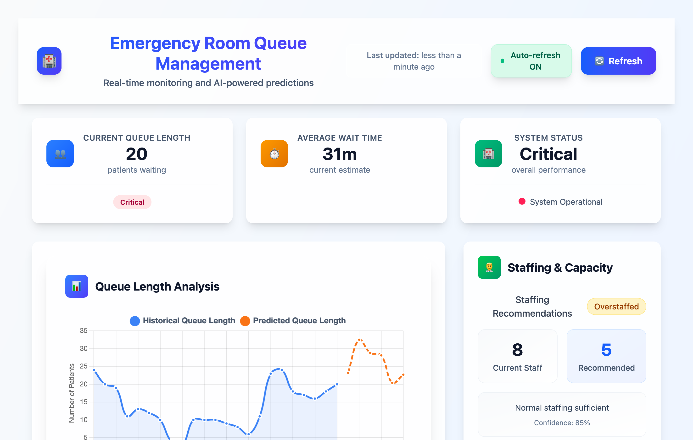

# 🏥 Emergency Room Queue Management System



## 🛠️ What You Need (Prerequisites)

Before you start, make sure you have these things:

### Essential Equipment 🖥️

- [ ] **A working computer** (Windows, Mac, or Linux - any will do!)
- [ ] **A mouse** (to click things)
- [ ] **A keyboard** (to type things)
- [ ] **A monitor/screen** (to see things)
- [ ] **Stable internet connection** (to download things)

### Required Software 📱

- [ ] **Web Browser** (Chrome, Firefox, Safari, Edge - any modern browser)
- [ ] **Git** ([Download here](https://git-scm.com/downloads))
- [ ] **Visual Studio Code** ([Download here](https://code.visualstudio.com/))
- [ ] **PowerShell** (Windows) or **Terminal** (Mac/Linux) - usually pre-installed

### That's it! 🎉

The Dev Container will handle everything else automatically (Node.js, Bun, dependencies, etc.)

---

## 🚀 Super Simple 4-Step Setup

### Step 1: Clone the Project 📥

Open your browser, find this project on GitHub, then open PowerShell/Terminal and clone it.


**What to do:**

1. Open your web browser
2. Navigate to this GitHub repository
3. Copy the repository URL
4. Open PowerShell (Windows) or Terminal (Mac/Linux)
5. Type: `git clone [repository-url]`
6. Press Enter and wait for it to download

---

### Step 2: Install Dev Containers Extension 🔌

Open VS Code and install the Dev Containers extension.


**What to do:**

1. Open Visual Studio Code
2. Click on the Extensions icon (🧩) on the left sidebar
3. Search for "Dev Containers"
4. Find the extension by Microsoft
5. Click "Install"
6. Wait for it to install

---

### Step 3: Open Project in Dev Container 📂

Open the project folder in VS Code and let it build the development environment.


**What to do:**

1. In VS Code, click "File" → "Open Folder"
2. Navigate to and select the project folder you cloned
3. VS Code will detect the Dev Container configuration
4. Click "Reopen in Container" when prompted (or "Build and reopen in container")
5. **BE PATIENT!** ⏳ This step takes a few minutes as it:
   - Downloads the container image
   - Installs all required software
   - Sets up the development environment
6. Get a coffee ☕ or pet a cat 🐱 while you wait

---

### Step 4: Run the Project 🏃‍♂️

Start the development servers and open the dashboard in your browser.


**What to do:**

1. Once the container is ready, open the terminal in VS Code (View → Terminal)
2. Type: `bun run dev`
3. Press Enter and wait for the servers to start
4. Open your web browser
5. Go to: `http://localhost:5173`
6. Press Enter
7. **Boom! 💥** You should see the Emergency Room Dashboard!

---

## 🎯 What You Should See

When everything is working correctly, you'll have:

- **Dashboard** running at `http://localhost:5173` - The main web interface
- **API Server** running at `http://localhost:3000` - The backend service
- **Mock IoT API** running at `http://localhost:3001` - Simulated sensor data

The dashboard will show:

- 📊 Real-time queue metrics
- 📈 Patient flow statistics
- � Current queue status
- 📱 Responsive design that works on any device

---

## 🆘 Troubleshooting (When Things Go Wrong)

### "Git is not recognized"

- **Solution:** Install Git from [git-scm.com](https://git-scm.com/downloads)

### "Code is not recognized" or VS Code won't open

- **Solution:** Install VS Code from [code.visualstudio.com](https://code.visualstudio.com/)

### Container build fails

- **Solution:** Make sure Docker is running (Dev Containers extension needs it)
- Try restarting VS Code and rebuilding the container

### "bun: command not found"

- **Solution:** You're probably not in the Dev Container. Make sure you clicked "Reopen in Container"

### Nothing loads at localhost:5173

- **Solution:** Wait a bit longer, the servers take time to start. Check the terminal for "Local:" messages

### Still stuck? 🤔

1. Close everything
2. Start over from Step 3
3. Make sure you're patient during the container build
4. Check that your internet connection is stable

---

## 🎉 Success! What Now?

Once you have the system running:

1. **Explore the Dashboard** - Click around, see the data visualizations
2. **Check the API** - Visit `http://localhost:3000/health` to see the backend
3. **Watch the Magic** - The system generates fake IoT data and displays real-time metrics!
4. **Make Changes** - Edit the code and see your changes live
5. **Learn Something** - This is a full-stack TypeScript application with real-time data!

---

## 🧠 What This Project Does

This is an **Emergency Room Queue Management System** that:

- 🏥 **Simulates IoT sensors** in a hospital emergency room
- 📊 **Collects real-time data** about patient flow
- � **Displays queue metrics** and patient statistics
- �📱 **Shows beautiful dashboards** with charts and metrics
- ⚡ **Updates in real-time** so you can see data change live

Perfect for learning about:

- Modern web development
- TypeScript/JavaScript
- API development
- Real-time data visualization
- Dev Container workflows

---

## 🏗️ Project Architecture

```
📦 Project Structure
├── 🖥️  apps/queue-management-dashboard/    # React frontend (localhost:5173)
├── 🔧  apps/queue-management-api/          # Fastify backend (localhost:3000)
├── 📡  apps/mock-iot-api/                  # IoT data simulator (localhost:3001)
├── 📋  scripts/                            # Helper scripts
└── 📚  docs/                               # Documentation & GIFs
```

Built with modern tools:

- **Bun** - Super fast JavaScript runtime
- **TypeScript** - Type-safe JavaScript
- **Fastify** - High-performance web framework
- **React** - Popular frontend library
- **Vite** - Lightning-fast build tool
- **TailwindCSS** - Utility-first CSS
